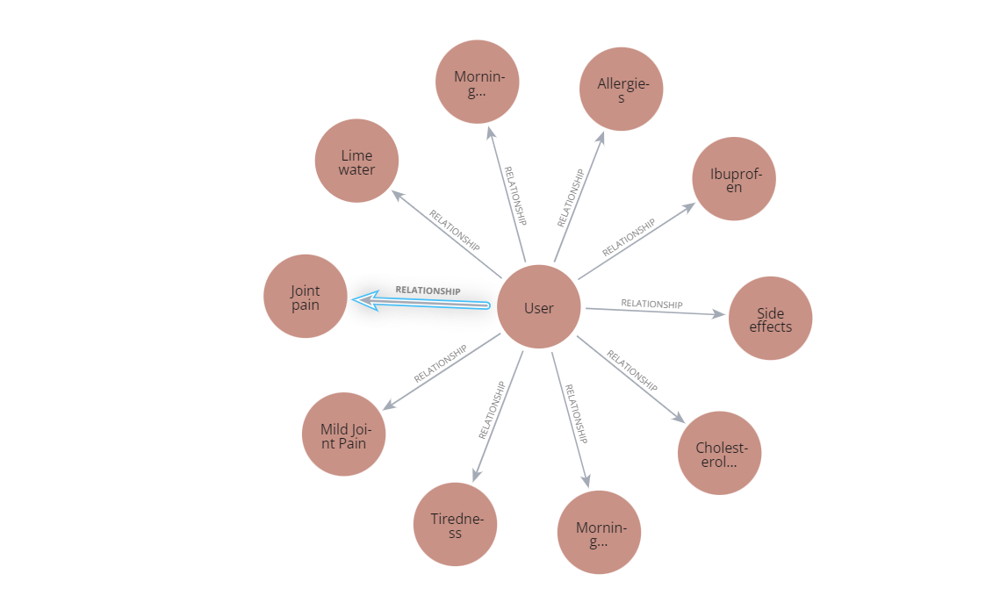
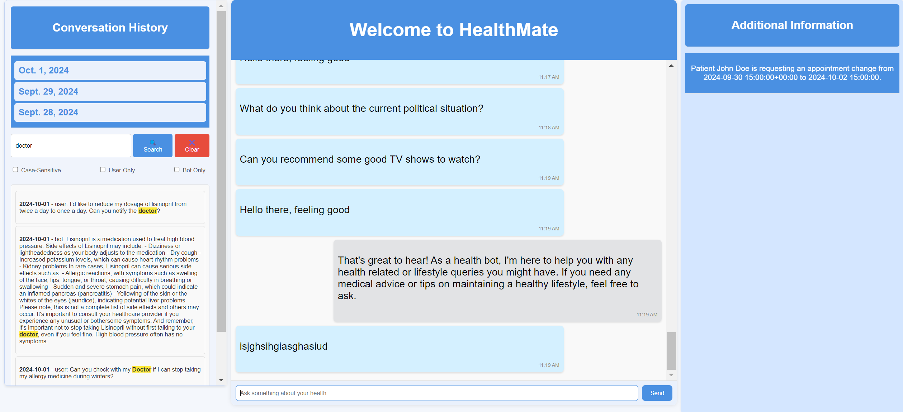

# HealthMate Chatbot

HealthMate is an AI-powered health assistant that helps users manage their health inquiries, schedule appointments, and view past interactions. This project uses Django, Neo4j, and other technologies to build an LLM-agnostic chatbot with the flexibility to integrate with various models.

## Table of Contents
1. [Project Overview](#project-overview)
2. [Key Features](#key-features)
3. [Setting Up the Project Locally](#setting-up-the-project-locally)
4. [Running the Application](#running-the-application)
5. [How to Use](#how-to-use)
6. [Assumptions](#assumptions)
7. [Additional Notes](#additional-notes)

## Project Overview
HealthMate is designed to assist users with the following:
- Answering health-related queries.
- Escalate change requests to Doctor.
- Maintaining conversation histories for easy reference.
- Using an LLM-agnostic design to swap different language models (e.g., OpenAI’s GPT-4 or Mistral models) with ease.
- Assistant logic graph:

- Current Knowledge Graph from conversations:


## Key Features
- **Conversational Health Assistance:** The chatbot can respond to user queries about health and appointments.
- **Change Requests Alerting:** Users can raise requests for appointment or Treatment changes to their doctor.
- **Conversation History:** Users can view their past interactions, filtered by date, in a side panel, with an added search functionality.
- **LLM-Agnostic Design:** The project supports multiple LLMs through a unified interface. Currently only OpenAI models are fully supported. Mistral's and Google's are in development.
- **RAG** Integrated Retrieval Augmented Generation(RAG), allowing chatbot to provide responses from a knowledge base.
- **Knowledge Graph Integration:** Connects to a Neo4j database for context-aware responses.

## Setting Up the Project Locally
Follow these instructions to set up the project on your local machine.

### Prerequisites
- **Python 3.10+**: Ensure you have Python installed.
- **Django 5.x**: Install the Django framework.
- **Neo4j**: You need a running instance of Neo4j or can use their cloud database AuraDB.
- **PostgreSQL**: For database management.

### Step 1: Clone the Repository
```bash
git clone https://github.com/nisargptl/healthmate.git
cd healthmate/healthmate
```

### Step 2: Set Up a Virtual Environment
```bash
python -m venv env
source env/bin/activate   # On Windows use `env\Scripts\activate`
```

### Step 3: Install Required Dependencies
Install the required Python packages:

```bash
pip install -r requirements.txt
```

### Step 4: Set Up Environment Variables
Create a `.env` file in the root directory and add the following environment variables:

```bash
# .env file
API_KEY=<your_llm_api_key>
LLM_MODEL=openai # (mistralai or googleai under development.) 
MODEL_NAME=<model_name> # (gpt-4)
PINECONE_API_KEY=<your_pinecone_api_key>
NEO4J_URI=<your_neo4j_uri>
NEO4J_USER=<your_neo4j_username>
NEO4J_PASSWORD=<your_neo4j_password>
DB_NAME=healthmate_db
DB_USER=<db_user>
DB_PASSWORD=<your_db_password>
```

### Step 5: Set Up the Database
Create Database:
```bash
psql -U postgres
CREATE DATABASE heatlthmate_db;
CREATE USER yourusername WITH PASSWORD 'yourpassword';
GRANT ALL PRIVILEGES ON DATABASE healthmate_db TO yourusername;
ALTER USER yourusername WITH SUPERUSER;
\q
```

Apply the database migrations:

```bash
python manage.py makemigrations
python manage.py migrate
```

### Step 6: Start the Django Development Server
```bash
python manage.py runserver
```

### Step 7: Access the Application
Open your browser and navigate to `http://127.0.0.1:8000` to access the HealthMate chatbot.

## Running the Application
To run the application, follow these steps:

1. **Activate the Virtual Environment:**
   ```bash
   source env/bin/activate   # On Windows use `env\Scripts\activate`
   ```

2. **Start the Django Server:**
   ```bash
   python manage.py runserver
   ```

3. **Access the Web Application:**
   Open your browser and go to `http://127.0.0.1:8000`.
   

## How to Use
1. **Ask Health-Related Queries:**
   Enter your health-related queries in the chatbox to receive AI-generated responses.

2. **Schedule or Reschedule Appointments:**
   Type phrases like "Can we reschedule my appointment to next Friday?" to initiate the appointment management flow.

3. **Treatment Change Requests:**
   Type phrases like "Can we increase my current cholesterol medicines dosage?" to initiate the change request management flow.

3. **View Past Conversations:**
   Use the sidebar to view past conversation histories by date. Clicking a date will load the conversations for that particular day.

4. **Additional Information:**
   Any relevant context or additional information will be displayed in the "Additional Information" sidebar.

##Some Feature Examples
Requesting Appointment changes:


Getting Personal info and health queries:


Requesting Treatment changes:


Search and filtering unrelated conversations:


## Assumptions
- The `OPENAI_API_KEY`, `PINECONE_API_KEY`, and other environment variables are set correctly in the `.env` file.
- Neo4j and PostgreSQL databases are set up and accessible.
- The user has basic knowledge of Django and Python.

## Additional Notes
- The project uses `langchain` and `langgraph` libraries to implement the chatbot flow and support for LLM integration.
- The frontend is built with vanilla JavaScript and custom CSS for responsive UI.

Feel free to reach out for support or if you encounter any issues while setting up the project. Wish you health!
